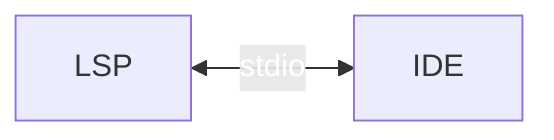
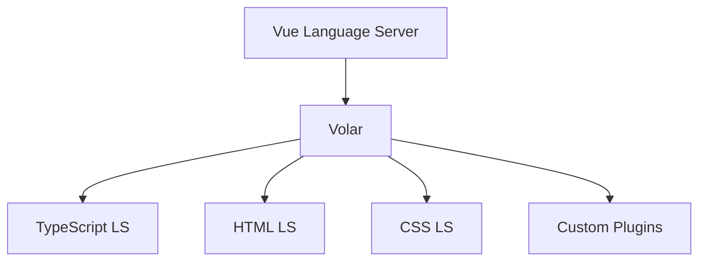
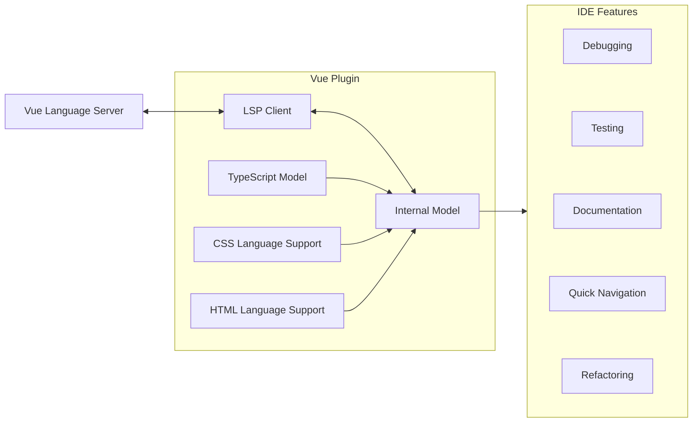

---
layout: center
---

<h1> What if... </h1>
<h2 v-click>We didn't have the Vue Language Server</h2>

---
---

<h1> Syntax Highlighting ✅ </h1>

```vue
<script setup>
import { ref } from 'vue'

const message = ref('Hello World!')

function reverseMessage() {
  // Access/mutate the value of a ref via
  // its .value property.
  message.value = message.value.split('').reverse().join('')
}

function notify() {
  alert('navigation was prevented.')
}
</script>

<template>
  <h1>{{ message }}</h1>
  <button @click="reverseMessage">Reverse Message</button>
  <button @click="message += '!'">Append "!"</button>
  <a href="https://vuejs.org" @click.prevent="notify">
    A link with e.preventDefault()
  </a>
</template>
```

---
layout: image
image: /syntax-highlting.png
backgroundSize: contain
---

---
---

# But...

<div class="flex h-full w-full">
    <ul class="flex h-full w-full flex-col">
        <li>Formatting ✅/❌</li>
        <li>Auto-Completion ❌</li>
        <li>TypeScript integration ❌</li>
    </ul>
    <ul class="flex h-full w-full flex-col">
        <li>Refactoring ❌</li>
        <li>Auto-imports ❌</li>
        <li>Documentation ❌</li>
    </ul>
</div>


---
layout: introduction
---

---
layout: center
---

# Volar

The engine powering Vue.js development <span v-click>and more...</span>

---
layout: image
image: /epic-handshake.png
backgroundSize: contain
---

---
layout: image
image: /Four-arm-handshake-meme.png
backgroundSize: contain
---

---
---

# Key Features

- Intelligent completion
- TypeScript integration
- Formatting
- Refactoring
- Auto-imports

<style>
    li{
        padding-top: 0.75rem;
        padding-bottom: 0.75rem;
    }
</style>

---
---

# What is a LSP

<div class="w-full h-90 flex items-center justify-center">

</div>

---
layout: center
---

# Language Server !== Language Service

---
---

# Volar Services

|                             | AST Provide | IntelliSense | Diagnostic | Formatting |
|-----------------------------|-------------|--------------|------------|------------|
| css                         | ✅           | ✅            | ✅          | ✅          |
| emmet                       |             | ✅            |            |            |
| html                        | ✅           | ✅            |            | ✅          |
| json                        | ✅           | ✅            | ✅          | ✅          |
| markdown                    |             | ✅            | ✅          |            |
| prettier                    |             |              |            | ✅          |
| prettyhtml                  |             |              |            | ✅          |

---
---

# Volar Services

|                             | AST Provide | IntelliSense | Diagnostic | Formatting |
|-----------------------------|-------------|--------------|------------|------------|
| prettyhtml                  |             |              |            | ✅          |
| pug                         | ✅           | ✅            | ✅          |            |
| pug-beautify                |             |              |            | ✅          |
| sass-formatter              |             |              |            | ✅          |
| typescript                  | ✅           | ✅            | ✅          | ✅          |
| typescript-twoslash-queries |             | ✅            |            |            |
| yaml                        |             | ✅            | ✅          |            |

---
---

# Architecture

<div class="w-full h-90 flex items-center justify-center">


</div>

---
---

# The Magic

1. AST parsing
2. Type inference
3. LS integration


---
---

# Embedded Languages

<div v-click="[1, 2]" class='text-8xl absolute z-5' style="color: var(--onu-colors-blue600); right: 250px; top: 95px">
    <mdi:arrow-left v-motion v-motion-roll-visible-right/> 
    <span class="text-4xl absolute" style="top: 35px">TypeScript</span>
</div>

<div v-click="[2, 3]" class='text-8xl absolute z-5' style="color: var(--onu-colors-yellow700); right: 400px; top: 200px">
    <mdi:arrow-left v-motion v-motion-roll-visible-right/> 
    <span class="text-4xl absolute" style="top: 35px;  text-wrap: nowrap">HTML-ish</span>
</div>

<div v-click="[3, 4]" class='text-8xl absolute z-5' style="color: var(--onu-colors-blue700); right: 250px; top: 300px">
    <mdi:arrow-left v-motion v-motion-roll-visible-right/> 
    <span class="text-4xl absolute" style="top: 35px;">CSS</span>
</div>


````md magic-move
```vue{*|1-3|5-10|12-16}
<script>
  const someError = "This is an Error for Demo Purposes"
</script>

<template>
  <div class="alert-box">
    <strong>{{someError}}</strong>
    <slot />
  </div>
</template>

<style scoped>
  .alert-box {
    background-color: tomato;
  }
</style>
```

```vue{*|6,10-12}
<script>
  const someError = "This is an Error for Demo Purposes"
</script>

<template>
  <div class="alert-box" style="background-color: salmon;">
    <strong>{{someError}}</strong>
    <slot />
  </div>
  <script>
    console.log("I am some fancy JavaScript")
  </script>
</template>

<style scoped>
  .alert-box {
    background-color: tomato;
  }
</style>
```
````

---
---

# Virtual Files

<div class="w-full h-90 border-b-white" style="border: 1px solid white; overflow: hidden; border-radius: 50px;">
    <div class="w-full h-10 flex items-center justify-center" style="background-color: #152238; padding-left: 30px"><span class="text-2xl">SomeFile.vue</span></div>
    <div class="w-full h-70 flex justify-between items-center text-4xl p-4">
        <div class="flex flex-col items-center">
            <mdi:file class="text-6xl"></mdi:file>
            <span>TypeScript</span>
        </div>
        <div class="flex flex-col items-center">
             <mdi:file class="text-6xl"></mdi:file>
            <span>HTML</span>
        </div>
        <div class="flex flex-col items-center">
             <mdi:file class="text-6xl">CSS</mdi:file>
            <span>CSS</span>
        </div>
    </div>
</div>

---
---

# Superpowers

- Cross-file analysis 🕵️
- type-checking 🧪
- High performance 💪
- Extensibility 🔌

<style>
    li{
        padding-top: 1rem;
        padding-bottom: 1rem;
    }
</style>

---
---

# DevTools for DevTools - Volar Labs


---
layout: full
---

# Take Over Mode

---
---

# How WebStorm handles Language Server



---
---
# The Future

<ul>
    <li>Faster 🚀</li>
    <li v-click>More integrations 🌐</li>
    <li v-click>AI-powered? 🤖</li>
    <li v-click>Your dreams ✨</li>
</ul>


<style>
    li{
        padding-top: 1rem;
        padding-bottom: 1rem;
    }
</style>

---
layout: cover
---

# Why should I care?!

---
layout: outro
url: https://wordman.dev/talk/2024/vue-de
---
